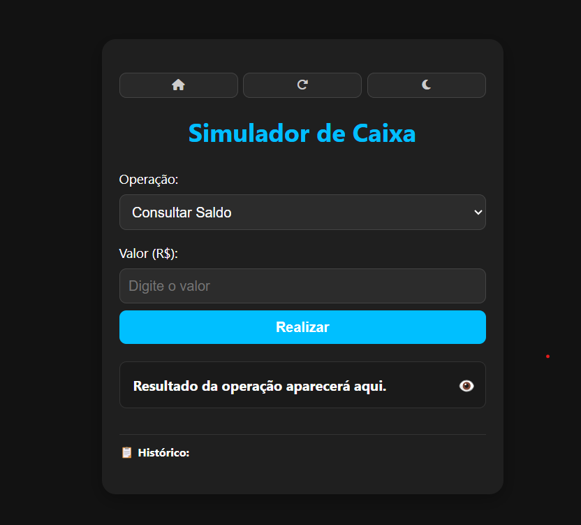

# 🏧 Simulador de Caixa Eletrônico

Um projeto de simulação de operações bancárias (Consultar saldo, Saque e Depósito), com interface moderna, modo escuro/claro e persistência via `localStorage`.

---

## 🚀 Funcionalidades

- 🔎 **Consultar Saldo**
- 💸 **Sacar**
- 💰 **Depositar**
- 🌗 **Alternar entre Modo Claro/Escuro**
- 👁️ **Ocultar/Exibir Saldo**
- 🔁 **Resetar caixa**
- 🏠 **Voltar ao menu inicial (simulado)**
- 📋 **Histórico de operações**
- 💾 **Persistência com localStorage**

---

## 💡 Tecnologias Usadas

- HTML5  
- CSS3  
- JavaScript Puro (Vanilla JS)

---

## 📂 Estrutura dos Arquivos

```
📁 projeto/
├── index.html         # Página principal com todo o código
├── README.md          # Este arquivo
```

---

## 🖥️ Como Executar

Você pode rodar o projeto diretamente no navegador:

### ✅ Opção 1: Com Live Server (VSCode)

1. Abra a pasta no VSCode.  
2. Clique com o botão direito no `index.html` e selecione **"Open with Live Server"**.

### ✅ Opção 2: Com `npx` (requer Node.js)

```bash
npx serve .
```

Depois, acesse: [http://localhost:3000](http://localhost:3000)

---

## 📸 Preview



---

## 📌 Observações

- O saldo inicial é de **R$ 1000**.
- O saldo e o histórico são salvos no `localStorage` e permanecem mesmo após atualizar a página.
- O botão de **Resetar** limpa o histórico e redefine o saldo para o valor inicial.

---

## 👨‍💻 Autor

Desenvolvido com 💙 por [Seu Nome]
